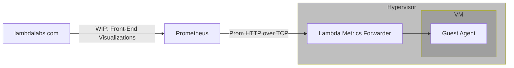
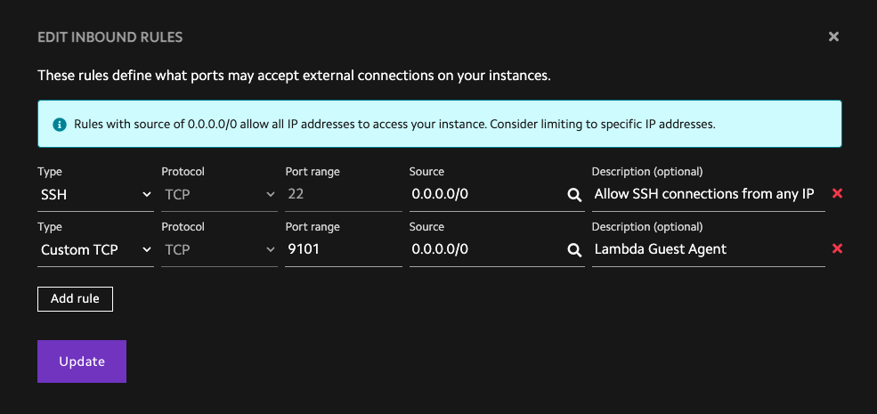

# Guest Agent

!!! warning "Beta Release"

    The guest agent is currently a Beta release.

    Lambda is providing access to the guest-agent before the visualizations are
    available on
    [lambdalabs.com](https://lambdalabs.com/){ .external target="_blank" }. The
    configuration that allows the self-hosted Prometheus and Grafana
    installations to scrape guest-agent metrics will be removed when the
    visualizations are fully available on
    [lambdalabs.com](https://lambdalabs.com/){ .external target="_blank" }. The
    full release of front-end visualizations will be available some time in
    2025.

    As this project is Beta, it might contain bugs, incomplete features, and other
    issues that might affect performance, security, and reliability. We also reserve
    the right to make breaking changes to the service. Because of these reasons,
    **the guest agent currently should only be used for testing and evaluation.**

    Please report any bugs you encounter to
    [Lambda's Support team](https://lambdalabs.com/support){ .external target="_blank" }.

## Introduction

lambda-guest-agent is a new service that Lambda provides that is installed on
customer VMs. The service collects a number of hardware-level details about VM
vitals, such as CPU utilization, GPU utilization, network IO, disk IO, etc and
forwards them into a metrics backend for display in visualizations.

The general flow of metrics can be described as such:



In this tutorial, you'll install the guest agent and set up
[Prometheus](https://www.prometheus.io/){ .external target="_blank" } and
[Grafana](https://grafana.com/){ .external target="_blank" } with an example
dashboard so you can visualize the collected metrics.

## Install the guest agent

To install the guest agent on an on-demand instance:

First, SSH into your instance by running:

```bash
ssh ubuntu@<IP_ADDRESS>
```

Replace `<IP_ADDRESS>` with the actual IP address of your instance.

Then, download and install the guest agent by running:

```bash
curl -L https://lambdalabs-guest-agent.s3.us-west-2.amazonaws.com/scripts/install.sh | sudo bash
```

Run the following command to confirm that the guest agent is running:

```bash
sudo systemctl status lambda-guest-agent*
```

You should see output similar to the following, indicating that the guest agent
is running:

```{ .text .no-copy }
● lambda-guest-agent.service - Lambda metrics and observability agent
     Loaded: loaded (/etc/systemd/system/lambda-guest-agent.service; enabled; vendor preset: enabled)
     Active: active (running) since Mon 2024-10-28 20:58:44 UTC; 18s ago
   Main PID: 68284 (telegraf)
      Tasks: 18 (limit: 271525)
     Memory: 11.5M
        CPU: 572ms
     CGroup: /system.slice/lambda-guest-agent.service
             └─68284 /usr/local/bin/lambda/guest-agent/telegraf -config /etc/lambda/guest-agent/telegraf/telegraf.conf

● lambda-guest-agent-updater.timer - Lambda metrics and observability agent updater
     Loaded: loaded (/etc/systemd/system/lambda-guest-agent-updater.timer; enabled; vendor preset: enabled)
     Active: active (waiting) since Mon 2024-10-28 20:58:44 UTC; 18s ago
    Trigger: Tue 2024-11-05 10:27:09 UTC; 1 week 0 days left
   Triggers: ● lambda-guest-agent-updater.service

Oct 28 20:58:44 192-222-52-58 systemd[1]: Started Lambda metrics and observability agent updater.

● lambda-guest-agent-updater.service - Lambda metrics and observability agent updater
     Loaded: loaded (/etc/systemd/system/lambda-guest-agent-updater.service; enabled; vendor preset: enabled)
     Active: active (exited) since Mon 2024-10-28 20:58:50 UTC; 12s ago
TriggeredBy: ● lambda-guest-agent-updater.timer
    Process: 68290 ExecStart=/bin/bash /usr/local/bin/lambda/guest-agent/guest-agent-update.sh (code=exited, status=0/SUCCESS)
   Main PID: 68290 (code=exited, status=0/SUCCESS)
        CPU: 4.845s
```

## Set up Prometheus and Grafana

Lambda is providing access to guest-agent before metrics are available on LambdaLabs.com.
Until that is available, these are steps you can follow to self-host a Prometheus
and Grafana installation to get access to the guest-agent metrics.

To set up Prometheus and Grafana:

1. SSH into one of your nodes:

    ```
    $ ssh -L 3000:localhost:3000 192.222.53.85
    ```

    !!! note "Port Forwarding"

        The `-L 3000:localhost:3000 ` argument specifies to SSH that it should open
        a tunnel for port `3000`. This will be used for logging into Grafana. This
        port must be open any time you want to connect to Grafana.

1. Clone the
   [Lambda Labs guest-agent repo](https://github.com/LambdaLabs/guest-agent){ .external target="_blank" }
   and change into the `guest-agent/prometheus-grafana` directory by
   running:

    ```bash
    git clone https://github.com/LambdaLabs/guest-agent.git && cd guest-agent/prometheus-grafana
    ```

1. Obtain the IP address of your instances.

    === "1CC"

        Use the private IP addresses for your cluster as listed on
        [cloud.lambdalabs.com](https://cloud.lambdalabs.com){ .external target="_blank" }.
        When installing Prometheus+Grafana for a 1CC installation, note that the
        GPU nodes are not publicly routable and can only be accessed from a head
        node. Because of this, it's recommended to install Prometheus+Grafana
        directly on a head node and use the private IP addresses as listed on
        your 1CC status page.

    === "On-Demand"

        Use the public IPs of your On-Demand instances if you desire to collect
        metrics from more than one instance. This means that the node where you
        install Prometheus must be able to contact other nodes on port `9101`,
        which may mean [opening a firewall rule](firewalls.md). See the [section
        below](#on-demand) for more details.


2. Edit the `prometheus/prometheus.yml` file.

    Under `#!yaml targets:`, change `#!yaml localhost:9101` to `#!yaml <PRIVATE_IP_ADDRESS>:9101`.

    Replace `<PRIVATE_IP_ADDRESS>` with the private IP address of your instance,
    which you obtained in the previous step.

    In the `prometheus.yml` file, the `scrape_configs` key should look like:

    ```{ .yaml .no-copy }
    scrape_configs:
    - job_name: prometheus
      honor_timestamps: true
      scrape_interval: 15s
      scrape_timeout: 10s
      metrics_path: /metrics
      scheme: http
      static_configs:
      - targets:
        - PRIVATE-IP-ADDRESS:9101
    ```

3. Edit the `compose.yaml` file and set `GF_SECURITY_ADMIN_PASSWORD` to a strong
   password.

    !!! tip

        You can generate a strong password by running:

        ```bash
        openssl rand -base64 32
        ```

4. Start Prometheus and Grafana containers on your instance by running:

    ```bash
    sudo docker compose up -d
    ```

5. In your web browser, go to
   [http://localhost:3000](http://localhost:3000){ .external target="_blank" }
   and log into Grafana. For the username, enter `admin`. For the password,
   enter the password you set earlier.

6. You'll see a Grafana dashboard displaying:

    - CPU usage
    - GPU utilization
    - GPU power draw
    - InfiniBand transfer rates
    - local storage transfer rates

    

    !!! note

        On-demand instances, unlike
        [1-Click Clusters](1-click-clusters/index.md), don't use InfiniBand
        fabric. Accordingly, the InfiniBand transfer rates will always be zero.

## Security

During the public beta release of guest-agent, the service exposes a Prometheus
listener on `0.0.0.0:9101`. As mentioned before, this listener is a temporary
measure to allow customers to gain access to metrics before they are available
on [lambdalabs.com](https://lambdalabs.com/){ .external target="_blank" }. The
sections below describe the implications of this listener for our public cloud
products.

### 1CC

Compute nodes in 1-Click-Clusters are not capable of accepting connections from
the public internet. Consequently, the `0.0.0.0:9101` listener can only be queried
from your head nodes. When self-hosting Prometheus and Grafana, it's recommended
to install them on one of your head nodes. This way, no tunnels are required to
access guest-agent metrics.

### On-Demand

When installed on an on-demand node, guest-agent metrics can only be queried after
exposing them either through an SSH tunnel (as described in [Install the guest agent](#install-the-guest-agent)),
or by opening up a hole in the Lambda firewall to accept connection requests to
port 9101. It is _NOT_ recommended to open up the firewall, as guest-agent is not
configured for TLS nor for any sort of authorization. Thus, an SSH tunnel is the
safest route as encryption and authorization can be done through the SSH protocol.

If you decide that opening guest-agent to the firewall is acceptable, you can do
so by selecting the `Firewall` tab in your [cloud dashboard](https://cloud.lambdalabs.com){ .external target="_blank" }
and adding a rule that looks like this:



### Data Privacy

Lambda takes your data privacy seriously. When you install guest-agent, we forward
your metrics to our internal metrics infrastructure. Lambda does not store any
personally identifying information in our metrics backend. The only customer-specific
identifiers we store is a unique ID that will only be used to allow [lambdalabs.com](https://lambdalabs.com/){ .external target="_blank" }
to gather your specific data once visualizations are available there. We do not store names,
email addresses, street addresses, billing information, VM hostnames, or any other
personally-identifying information on our metrics backend beyond what is
necessary to serve your data to you.

## Updates

The guest-agent will automatically update itself on a two-week cadence. You may disable
updates by stopping and disabling the `lambda-guest-agent-updater.timer` systemd unit:

```
sudo systemctl stop lambda-guest-agent-updater.timer
sudo systemctl disable lambda-guest-agent-updater.timer
```

## Disablement

Furthermore, you may disable the guest-agent entirely by removing the guest-agent
apt package. Upon removal, the package will stop disable all services:

```bash
sudo apt remove lambda-guest-agent
```
