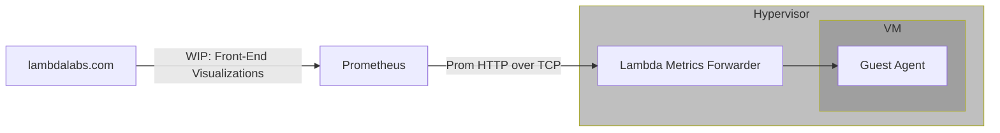

# Guest Agent

!!! warning "Beta Release"

    The guest agent is currently a Beta release.

    Lambda is providing access to the guest-agent before the visualizations are
    available on
    [lambdalabs.com](https://lambdalabs.com/){ .external target="_blank" }. The
    configuration that allows the self-hosted Prometheus and Grafana
    installations to scrape guest-agent metrics will be removed when the
    visualizations are fully available on
    [lambdalabs.com](https://lambdalabs.com/){ .external target="_blank" }. The
    full release of front-end visualizations will be available some time in
    2025.

    As this project is Beta, it might contain bugs, incomplete features, and other
    issues that might affect performance, security, and reliability. We also reserve
    the right to make breaking changes to the service. Because of these reasons,
    **the guest agent currently should only be used for testing and evaluation.**

    Please report any bugs you encounter to
    [Lambda's Support team](https://lambdalabs.com/support){ .external target="_blank" }.

## Introduction

lambda-guest-agent is a new service that Lambda provides that is installed on
customer VMs. The service collects a number of hardware-level details about VM
vitals, such as CPU utilization, GPU utilization, network IO, disk IO, etc and
forwards them into a metrics backend for display in visualizations.

The general flow of metrics can be described as such:



In this tutorial, you'll install the guest agent and set up
[Prometheus](https://www.prometheus.io/){ .external target="_blank" } and
[Grafana](https://grafana.com/){ .external target="_blank" } with an example
dashboard so you can visualize the collected metrics.

## Install the guest agent

To install the guest agent on an on-demand instance:

First, SSH into your instance by running:

```bash
ssh ubuntu@<IP_ADDRESS> -L 3000:localhost:3000
```

Replace `<IP_ADDRESS>` with the actual IP address of your instance.

!!! note

    The `-L 3000:localhost:3000` option enables local port forwarding. Local
    port forwarding is needed to access the Grafana dashboard you'll create
    in a later step.
    [See the SSH man page to learn more](https://manpages.ubuntu.com/manpages/jammy/en/man1/ssh.1.html){ .external target="_blank" }.

Then, download and install the guest agent by running:

```bash
curl -L https://lambdalabs-guest-agent.s3.us-west-2.amazonaws.com/scripts/install.sh | sudo bash
```

Run the following command to confirm that the guest agent is running:

```bash
sudo systemctl status lambda-guest-agent*
```

You should see output similar to the following, indicating that the guest agent
is running:

```{ .text .no-copy }
● lambda-guest-agent.service - Lambda metrics and observability agent
     Loaded: loaded (/etc/systemd/system/lambda-guest-agent.service; enabled; vendor preset: enabled)
     Active: active (running) since Mon 2024-10-28 20:58:44 UTC; 18s ago
   Main PID: 68284 (telegraf)
      Tasks: 18 (limit: 271525)
     Memory: 11.5M
        CPU: 572ms
     CGroup: /system.slice/lambda-guest-agent.service
             └─68284 /usr/local/bin/lambda/guest-agent/telegraf -config /etc/lambda/guest-agent/telegraf/telegraf.conf

● lambda-guest-agent-updater.timer - Lambda metrics and observability agent updater
     Loaded: loaded (/etc/systemd/system/lambda-guest-agent-updater.timer; enabled; vendor preset: enabled)
     Active: active (waiting) since Mon 2024-10-28 20:58:44 UTC; 18s ago
    Trigger: Tue 2024-11-05 10:27:09 UTC; 1 week 0 days left
   Triggers: ● lambda-guest-agent-updater.service

Oct 28 20:58:44 192-222-52-58 systemd[1]: Started Lambda metrics and observability agent updater.

● lambda-guest-agent-updater.service - Lambda metrics and observability agent updater
     Loaded: loaded (/etc/systemd/system/lambda-guest-agent-updater.service; enabled; vendor preset: enabled)
     Active: active (exited) since Mon 2024-10-28 20:58:50 UTC; 12s ago
TriggeredBy: ● lambda-guest-agent-updater.timer
    Process: 68290 ExecStart=/bin/bash /usr/local/bin/lambda/guest-agent/guest-agent-update.sh (code=exited, status=0/SUCCESS)
   Main PID: 68290 (code=exited, status=0/SUCCESS)
        CPU: 4.845s
```

## Set up Prometheus and Grafana

Lambda is providing access to guest-agent before metrics are available on LambdaLabs.com.
Until that is available, these are steps you can follow to self-host a Prometheus
and Grafana installation to get access to the guest-agent metrics.

To set up Prometheus and Grafana:

1. Clone the
   [Awesome Compose GitHub repository](https://github.com/docker/awesome-compose){ .external target="_blank" }
   and change into the `awesome-compose/prometheus-grafana` directory by
   running:

    ```bash
    git clone https://github.com/docker/awesome-compose.git && cd awesome-compose/prometheus-grafana
    ```

1. Obtain the private IP address of your instance by running:

    ```bash
    ip -4 -br addr show eno1 | grep -Eo '(25[0-5]|2[0-4][0-9]|[01]?[0-9][0-9]?)\.(25[0-5]|2[0-4][0-9]|[01]?[0-9][0-9]?)\.(25[0-5]|2[0-4][0-9]|[01]?[0-9][0-9]?)\.(25[0-5]|2[0-4][0-9]|[01]?[0-9][0-9]?)'
    ```

1. Edit the `prometheus/prometheus.yml` file.

    Under `targets`, change `localhost:9090` to `<PRIVATE_IP_ADDRESS>:9101`.

    Replace `<PRIVATE_IP_ADDRESS>` with the private IP address of your instance,
    which you obtained in the previous step.

    !!! note

        Make sure you're changing both the host and the port. It's frequently
        overlooked that the port is being changed as well as the host.

    In the `prometheus.yml` file, the `scrape_configs` key should look like:

    ```{ .yaml .no-copy }
    scrape_configs:
    - job_name: prometheus
      honor_timestamps: true
      scrape_interval: 15s
      scrape_timeout: 10s
      metrics_path: /metrics
      scheme: http
      static_configs:
      - targets:
        - PRIVATE-IP-ADDRESS:9101
    ```

1. Edit the `compose.yaml` file and set `GF_SECURITY_ADMIN_PASSWORD` to a strong
   password.

    !!! tip

        You can generate a strong password by running:

        ```bash
        openssl rand -base64 16
        ```

1. Start Prometheus and Grafana containers on your instance by running:

    ```bash
    sudo docker compose up -d
    ```

1. In your web browser, go to
   [http://localhost:3000](http://localhost:3000){ .external target="_blank" }
   and log into Grafana. For the username, enter `admin`. For the password,
   enter the password you set earlier.

1. At the top-right of the dashboard, click the **+**. Then, choose **Import
   dashboard**.

    

1. In the **Import via dashboard JSON model** field, enter the
   [example JSON model](https://gist.githubusercontent.com/LandonTClipp/964e90507d660e3fb710b4137be6cd6f/raw/bc7abd797da65581534513c153d1ad3d1b8e4bbe/lambda-guest-agent-grafana-model.json){ .external target="_blank" }
   prepared for this tutorial, then click **Load**. In the following screen,
   click **Import**.

1. You'll see a Grafana dashboard displaying:

    - CPU usage
    - GPU utilization
    - GPU power draw
    - InfiniBand transfer rates
    - local storage transfer rates

    

    !!! note

        On-demand instances, unlike
        [1-Click Clusters](../1-click-clusters/index.md), don't use InfiniBand
        fabric. Accordingly, the InfiniBand transfer rates will always be zero.

## Updates

The guest-agent will automatically update itself on a two-week cadence. You may disable
updates by stopping and disabling the `lambda-guest-agent-updater.timer` systemd unit:

```
sudo systemctl stop lambda-guest-agent-updater.timer
sudo systemctl disable lambda-guest-agent-updater.timer
```

## Disablement

Furthermore, you may disable the guest-agent entirely by removing the guest-agent
apt package. Upon removal, the package will stop disable all services:

```bash
sudo apt remove lambda-guest-agent
```
